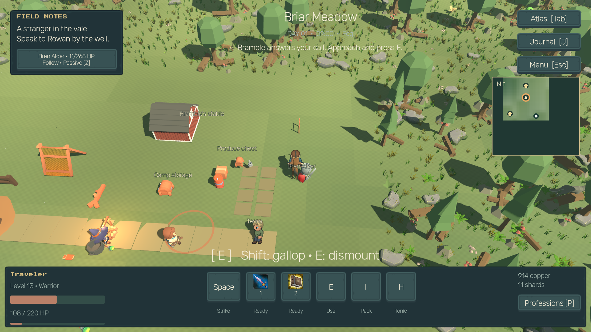

# Relic Vale / Реликтовая долина

**Русский** · [English](#english)

Relic Vale — одиночная фэнтезийная RPG на Godot 4.7.2. Вы исследуете процедурный мир, помогаете деревням, строите лагерь, сражаетесь, рыбачите, занимаетесь ремёслами и путешествуете со спутниками и на лошади. Мир подгружается чанками; карта, погода, время суток и сохранения поддерживают долгую игру.

## Скачать и запустить

Готовая Windows-версия 0.10.0 доступна в [Releases](https://github.com/samayoucore/relic-vale/releases): установщик `RelicVale-0.10.0-Setup.exe` и переносимый архив `RelicVale-0.10.0-Portable.zip`. Для игры нужен Windows 10 x64 (1809+) и видеодрайвер с OpenGL 3.3. Godot, Python, Git и инструменты разработки игроку не нужны. Установщик работает без прав администратора; ZIP нужно полностью распаковать, сохраняя `RelicVale.exe` рядом с `RelicVale.pck`.

Если игра не открывается с обычными настройками, используйте ярлык **Relic Vale - Safe Mode** или запустите переносимую версию с аргументами `-- --safe-mode`. Сохранения и настройки находятся в `%APPDATA%\Godot\app_userdata\RelicValePrototype\`; при удалении игры они сохраняются. Имя папки осталось прежним ради совместимости со старыми версиями.

## Управление

WASD — движение, Shift — бег, Ctrl — уклонение, E — взаимодействие, Space/левая кнопка мыши — атака. I — инвентарь, J — задания, Tab — атлас, G — лагерь, P — профессии, B — умения, O — спутники, F6/F9 — сохранение/загрузка. Камера: Q/R или зажатая правая кнопка мыши, колесо — масштаб, Page Up/Down — наклон. Первое задание даёт Роуэн у колодца стартовой деревни.

Чтобы оседлать лошадь, развейте лагерь до уровня 3, купите её за 180 медных монет в **P → Mounts**, нажмите **V** для вызова, подойдите и нажмите **E**. Клавиша **V** спешивает на свободном месте. Привязку можно сменить на T или Y в настройках.

## Исходный проект

Откройте [`relic_vale/project.godot`](relic_vale/project.godot) в редакторе Godot 4.7.2. Игровые ресурсы находятся в `relic_vale/assets/`; сгенерированный кэш `.godot`, инструменты сборки, локальные сохранения и архивы релиза в Git не входят. Для создания установщика из исходников нужны закреплённые версии Godot export templates, Node.js и Inno Setup; порядок описан в [RELEASE_PROCESS.md](relic_vale/docs/RELEASE_PROCESS.md). Команда локальной сборки: `powershell -ExecutionPolicy Bypass -File .\build_release.ps1`.

Проект проверен на одном Windows 10 ПК. Другие конфигурации и чистый ПК без средств разработки пока не тестировались. В быстром перемещении по новым чанкам возможны короткие задержки. Подробности: [QA](relic_vale/docs/QA_CHECKLIST.md), [производительность](relic_vale/docs/PERFORMANCE.md), [изменения](tools/release/RELEASE_NOTES.txt). Установщик не подписан сертификатом.

Исходный код опубликован для просмотра; единая лицензия на весь проект не заявлена. Сторонние модели, звуки, шрифты и адаптированные LPC-спрайты сохраняют свои условия. См. [авторов и лицензии](relic_vale/docs/ASSET_CREDITS.md) и [`THIRD_PARTY_LICENSES.txt`](relic_vale/THIRD_PARTY_LICENSES.txt).

## English

Relic Vale is a single-player fantasy RPG built with Godot 4.7.2. Explore a streamed procedural world, help villages, develop a camp, fight, fish, craft, and travel with companions and a horse. The atlas, weather, day/night cycle, and persistent saves support longer journeys.

### Download and play

Get version 0.10.0 from [Releases](https://github.com/samayoucore/relic-vale/releases): `RelicVale-0.10.0-Setup.exe` or `RelicVale-0.10.0-Portable.zip`. The tested target is Windows 10 x64 (1809+) with OpenGL 3.3 graphics. Players do not need Godot or development tools. The installer is per-user; extract the entire portable ZIP and keep the EXE and PCK together. Safe Mode is available through the Start Menu shortcut or `RelicVale.exe -- --safe-mode`.

Saves and settings live in `%APPDATA%\Godot\app_userdata\RelicValePrototype\` and survive uninstall. The legacy folder name preserves compatibility with earlier saves.

### Controls

WASD moves, Shift runs, Ctrl dodges, E interacts, and Space/left click attacks. I opens inventory, J quests, Tab the atlas, G the camp, P professions, B abilities, O companions, and F6/F9 save/load. Orbit the camera with Q/R or right-drag, zoom with the wheel, and tilt with Page Up/Down. Speak to Rowan near the starting village well for the first objective.

For a horse, reach camp tier 3 and buy one for 180 copper in **P → Mounts**. Press **V** to call it, approach and press **E** to mount; **V** dismounts on open ground. The binding can be changed to T or Y.

### Source and verification

Open [`relic_vale/project.godot`](relic_vale/project.godot) with Godot 4.7.2. Runtime assets are included. Generated caches, local build tools, saves, and release archives are omitted from Git. Building the installer requires the pinned export templates, Node.js, and Inno Setup; see the [release process](relic_vale/docs/RELEASE_PROCESS.md). The local command is `powershell -ExecutionPolicy Bypass -File .\build_release.ps1` once those dependencies are installed.

The game was measured on one Windows 10 PC; other hardware and a clean Windows PC have not been verified. New-chunk streaming can still cause short frame spikes. See the [QA checklist](relic_vale/docs/QA_CHECKLIST.md), [performance data](relic_vale/docs/PERFORMANCE.md), and release notes. The Windows binaries are unsigned.

The source is public for inspection; no single license is asserted for the whole project. Third-party assets and adapted LPC sprites retain their own terms. See [asset credits](relic_vale/docs/ASSET_CREDITS.md) and [`THIRD_PARTY_LICENSES.txt`](relic_vale/THIRD_PARTY_LICENSES.txt).
