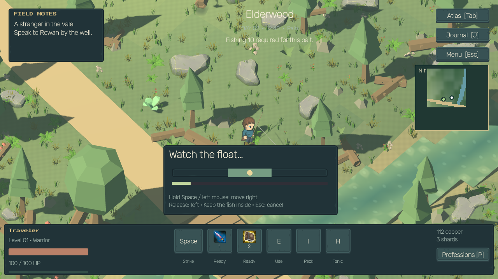
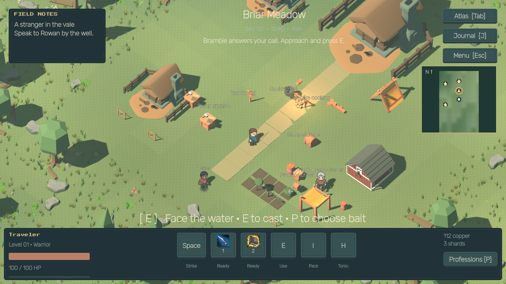
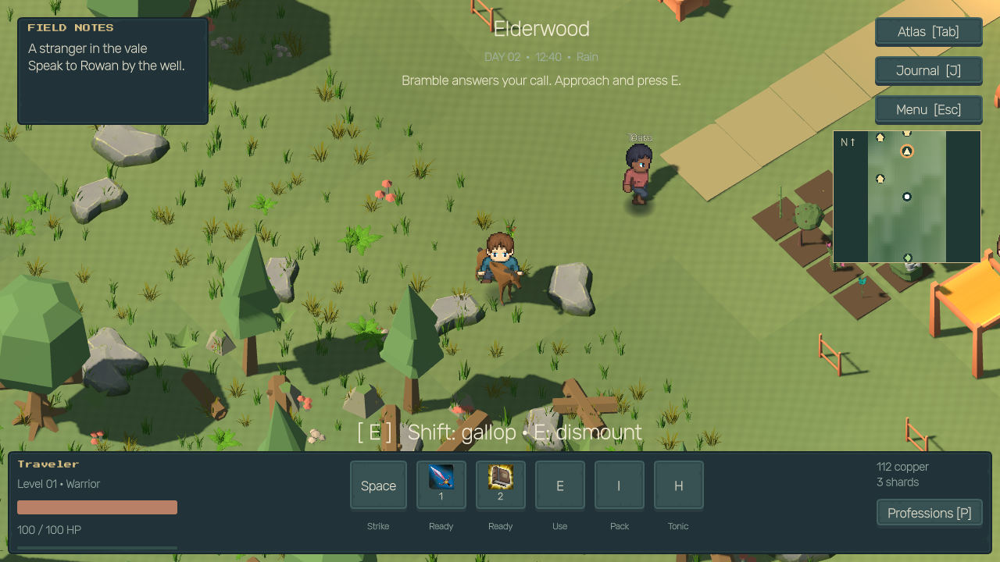
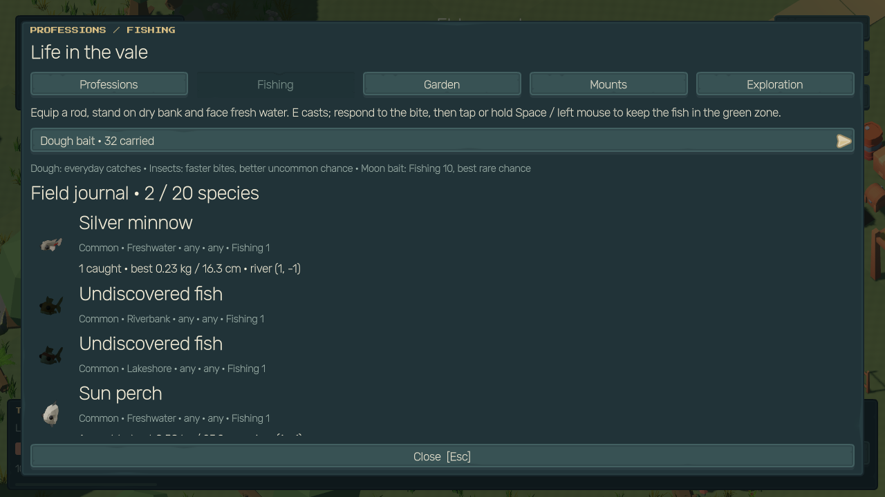
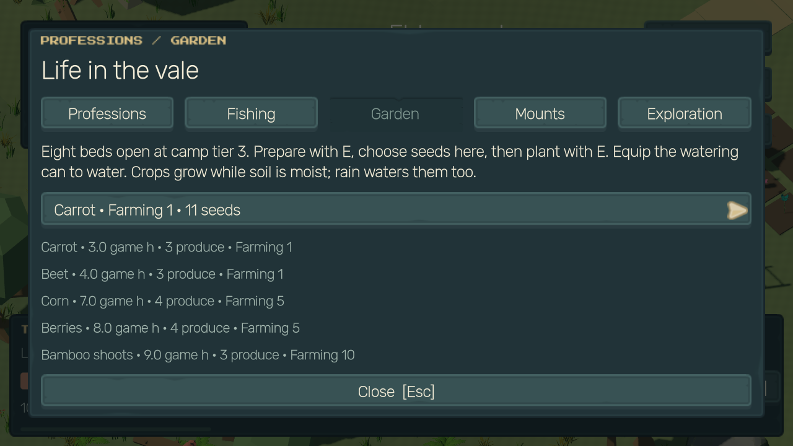
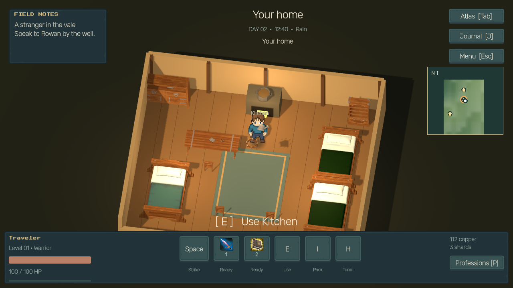

# Phase 8 — implemented release

The existing Godot project now includes six independent professions, 20 fish species with an interactive fishing loop, 24 cooking recipes, eight crops, five continuing camp occupations, a persistent animated horse, rare profession resources and treasure charts. Phase 7 atlas/camp systems and the earlier limited camera tilt/obstruction hiding remain in place. All new models and runtime data are bundled locally.

## Play

Launch **Launch Relic Vale.bat** from the workspace root. **P** opens professions, journal, garden, mounts and exploration; **I** equips rods/tools; **E** casts or interacts; **Space/left mouse** controls the fishing zone; **V** calls/dismounts the horse; **Shift** gallops; **G** manages resident occupations. **F8** contains test controls for skill levels, supplies, water/bites, crop stages/rain, camp farm, mounts and charts. Normal progression does not require debug controls.

Buy a rod/bait from Iona and seeds/watering can from Nell in Willowmere's shop. Basic supplies are also available from existing merchants. Establish and raise a camp through the existing tier system; tier 3 unlocks beds and the stable. Cook at the campfire, tier-2 cooking pot or a kitchen. See [professions](PROFESSIONS.md), [fishing species and rules](FISHING.md), [cooking recipes](COOKING.md), [farming and residents](FARMING.md) and [mounts](MOUNTS.md).

## Validation

Tests ran inside the actual Godot 4.7.2 scene, including native-window rendering on AMD Radeon Vega 8. The main gameplay script uses physical gathering actions, actual cast/bite/reel input, manual planting/watering/harvesting, three recipes and food replacement/expiry, then leaves the farm unloaded, advances the world clock, returns and verifies worker production. It purchases/mounts the horse and physically gallops through at least three chunks before testing teleport, treasure rewards and saves. A separate Godot process reloads that save.

| Run | Passed | Failed | Engine errors |
| --- | --- | --- | --- |
| Gameplay, native GUI | 74 | 0 | 0 |
| Gameplay, headless | 74 | 0 | 0 |
| Fresh process reload | 6 | 0 | 0 |
| Edge cases, native GUI | 61 | 0 | 0 |
| Phase 7 real save migration | 6 | 0 | 0 |
| Gathering/residents/economy regression | 26 | 0 | 0 |
| Combat regression | 21 | 0 | 0 |
| Camera/graphics/UI regression, native GUI | 38 | 0 | 0 |
| Final bait/cooking/kitchen checks, native GUI | 15 | 0 | 0 |

Recorded assertion executions: **321 passed / 0 failed** across 9 completed runs. GUI/headless gameplay assertions overlap intentionally. Exact checks and log names are in [PHASE_8_TEST_RESULTS.json](PHASE_8_TEST_RESULTS.json). Workspace logs remain under downloads; release documents include the result manifest and screenshots.

Edge cases cover occupation/expedition exclusion, cook/forager/woodworker/fisher catch-up, no personal worker XP, dry soil/rain, level AND tool gates, level cap, malformed saves, schemas 2–7, merchant arbitrage, all 20 rendered fish icons, mount binding, invalid casts, animation instantiation, cancellation, direct HUD combat restrictions, billion-chunk ownership, nearby horse repositioning, all five dashboard pages, player-home kitchen, full hamlet layout and 150% UI scale.

Test outputs use separate journey filenames. The player's journey is read only for compatibility and is never used as a test output. Save schema 8 accepts schemas 2–7 and defaults the new fields. Keep each journey JSON together with its .chunks folder. The phase-7 baseline ZIP remains preserved; the phase-8 ZIP includes the engine, launchers, source and assets, with no personal saves or import cache. Its external receipt contains the final SHA-256 and per-file ZIP verification count.

Release gates also verify a fresh editor import and main-scene startup in a separate project copy with separate userdata, without relying on the working project's import cache. [Release checks](PHASE_8_RELEASE_CHECKS.json) record the clean result and asset/link validation. [Performance snapshots](PHASE_8_PERFORMANCE.json) retain scene/preset measurements; they are transition-time diagnostics rather than a controlled benchmark.

## Visual evidence

## Scope and practical limits

- Fish ecology and rarity are fantasy gameplay rules. Two fish animate near an active cast; there is no permanent ecosystem simulation in unloaded water.
- Humanoids retain LPC sprites. Imported UAL2 arm curves drive held tools; riding uses a seated sprite adaptation. This is not full skeletal retargeting. The horse itself and nearby fish use authored skeletal animations.
- Eight camp beds, one purchasable horse and a basic barn stall are implemented. Crop/resident catch-up follows game time, not real-world time while the game is closed. Residents produce small quantities of common supplies and do not train player professions.
- Rare deposits reuse compatible earlier tree/rock/plant meshes with material variants. Source models/animations, conversions, generated icons and their licenses are detailed in [asset credits](ASSET_CREDITS.md) and [PHASE_8_ASSETS.json](PHASE_8_ASSETS.json).
- Rendering shares the existing draw-call limits on Vega 8. Lower graphics presets remain available; this phase does not promise a fixed frame rate on every device. Active chunk limits, two near-cast fish and bounded catch-up prevent far-away production from creating unbounded scene actors.
